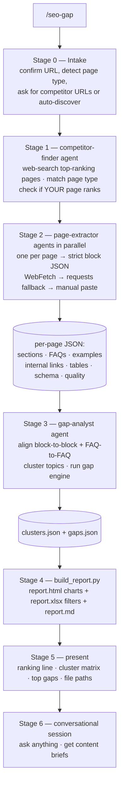

# How it works — the flow

## Stages
| # | Stage | Output |
|---|---|---|
| 0 | **Intake** | `meta.json` (topic, page type, your URL, competitors) |
| 1 | **Discover + rank** | ranking list + whether your page ranks |
| 2 | **Extract (parallel)** | `our.json`, `competitor-*.json` (block schema) |
| 3 | **Align + cluster + gap engine** | `clusters.json`, `gaps.json` |
| 4 | **Reports** | `report.html`, `report.xlsx` / CSV, `report.md` |
| 5 | **Present** | inline summary + cluster matrix + top gaps |
| 6 | **Converse** | answers + content briefs (no finished copy) |

## Gap types the engine computes
`missing` (add) · `thin` (expand) · `unique` (keep/promote) · `faq` (add an answer) ·
`link` (add internal link) · `example` (add a worked example/table) · `quality` (fix on-page SEO).
Each carries a **priority 1–3** = (how many competitors have it) × (how decision-critical it is).

## Design choices
- **Page-level**, like-for-like (product↔product, blog↔blog, FAQ↔FAQ).
- **Generic** — no client identity baked in.
- **Grounded** — every gap traces to extracted content; rankings are reported honestly.
- **No content generation** — briefs, outlines, checklists only.
- **Resilient crawling** — WebFetch (server-side, works on locked-down networks) → local
  `requests` with browser headers → manual paste for bot-blocked sites.
